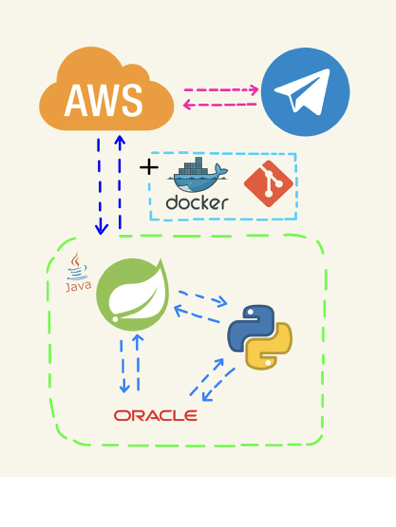
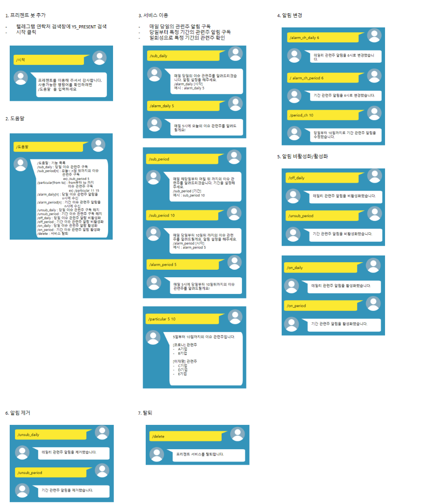

# 1. YS_PRESENT 개요
+ 가까운 미래에 이슈가 될 테마주를 미리 알려주는 텔레그램 알림 서비스
+ 뉴스 스크랩핑을 통해 특정 기간의 정치 / 경제 / 사회적 이슈의 관련주를 찾아 알려준다.
+ 뿐만 아니라 사용자 별 알림 받는 시간 설정 ,  알람 on/off , 메뉴얼 보기 등을 제공

# 2. 사용하는 언어 & 기술
1) Spring 
2) Java
3) Python
4) AWS
5) Docker
6) Oracle
7) Git
8) Restful API

# 3. 시스템 구성도

# 4. 개발 일정(Gantt)
|TO DO|DEADLINE|
|------|---|
|~구현 가능 여부 테스트~|~\~ 12 / 20~|
|구조 및 설계(기능명세 / 유저 인터페이스 / DB)|~ 1 / 1|
|개발 환경 세팅|~ 1 / 18|
|개발|~ 2 / 19|
|테스트|~ 3 / 12| 	
# 5. YS_PRESENT 기능 명세서
|번호|기능|시나리오|Url 맵핑|
|---|---|-----|-----|
|1|	시작하기|	채팅방에 들어 온 사용자 정보 세팅|	\/start (post)|
|2|	도움말|	사용자가 KEY IN 할 수 있는 리스트 반환|	\/help|
|3|구독| 당일 이슈 관련주 구독 설정  당일 ~ N일 간 이슈 관련주 기간 구독 설정| \/user\/subDaily  \/user\/subPeriod|
|4|	특정 기간 관련주 알림|	당월 From N To M 간 이슈 관련주 알림| 	\/sendParticular|
|5|	알람 설정 및 변경| 사용자의 당일 구독 알림 설정 및 변경   사용자의 기간 구독 알림 설정 및 변경| \/user\/subDaily\/alarm\/setTime   \/user\/subPeriod\/alarm\/setTime|
|6|	기간 일자 설정 및 변경|	사용자가 기간 구독하는 경우 일자 설정 및 변경| 	/user/subPeriod/alarm/setDay|
|7|	구독 해지	|사용자의 당일 구독 해지   사용자의 기간 구독 해지| /user/unsubDaily   /user/unsubPeriod|
|8|	알람 On/ Off|사용자의 당일 구독 알람 설정 변경   사용자의 기간 구독 알람 설정 변경|/user/subDaily/alramOn   /user/subDaily/alramOff   /user/subPeriod/alarmOn   /user/subPeriod/alarmOff|
|9|	탈퇴하기|	사용자의 해당 서비스 탈퇴|	/user/delete|

# 6. 유저 인터페이스 설계

# 7. DB 설계
_곧 작성 예정_
